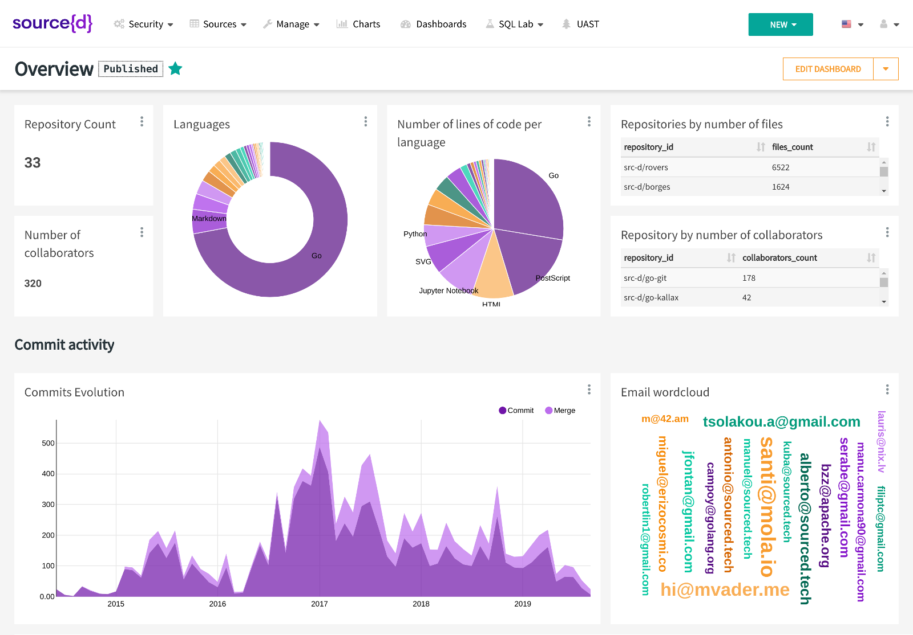

<a href="https://www.sourced.tech">
  
</a>

**source{d} Community Edition (CE) is the data platform for your software development life cycle.**

[](https://github.com/src-d/sourced-ce/releases)
[](https://travis-ci.com/src-d/sourced-ce)

[](https://goreportcard.com/report/github.com/src-d/sourced-ce)
[](https://godoc.org/github.com/src-d/sourced-ce)

[Website](https://www.sourced.tech) •
[Documentation](https://docs.sourced.tech/community-edition) •
[Blog](https://blog.sourced.tech) •
[Slack](http://bit.ly/src-d-community) •
[Twitter](https://twitter.com/sourcedtech)




## Introduction

**source{d} Community Edition (CE)** helps you to manage all your code and engineering data in one place:

- **Code Retrieval**: Retrieve and store the git history of the code of your organization as a dataset.
- **Analysis in/for any Language**: Automatically identify languages, parse source code, and extract the pieces that matter in a language-agnostic way.
- **History Analysis**: Extract information from the evolution, commits, and metadata of your codebase and from GitHub, generating detailed reports and insights.
- **Familiar APIs**: Analyze your code through powerful SQL queries. Use tools you're familiar with to create reports and dashboards.

This repository contains the code of **source{d} Community Edition (CE)** and its project documentation, which you can also see properly rendered at [docs.sourced.tech/community-edition](https://docs.sourced.tech/community-edition).


### Contents

- [Introduction](#introduction)
- [Quick Start](#quick-start)
- [Contributing](#contributing)
- [Community](#community)
- [Code of Conduct](#code-of-conduct)
- [License](#license)


## Quick Start

**source{d} CE** supports Linux, macOS, and Windows.

To run it you only need:

1. To have Docker installed in your PC
1. Download `sourced` binary (for your OS) from [our releases](https://github.com/src-d/sourced-ce/releases)
1. Run it:
   ```bash
   $ sourced init orgs --token=<github_token> <github_org_name>
   ```
   And log in into http://127.0.0.1:8088 with login: `admin`, and password: `admin`.

If you want more details of each step, you will find in the [**Quick Start Guide**](docs/quickstart/README.md) all the steps to get started with **source{d} CE**, from the installation of its dependencies to running SQL queries to inspect git repositories.


## Architecture

_For more details on the architecture of this project, read [docs/architecture.md](docs/architecture.md)._

**source{d} CE** is deployed as Docker containers, using Docker Compose.

This tool is a wrapper for Docker Compose to manage the compose files and its containers easily. Moreover, `sourced` does not require a local installation of Docker Compose, if it is not found it will be deployed inside a container.

The main entry point of **source{d} CE** is [sourced-ui](https://github.com/src-d/sourced-ui), the web interface from where you can access your data, create dashboards, run queries...

The data exposed by the web interface is prepared and processed by the following services:

- [babelfish](https://doc.bblf.sh): universal code parser.
- [gitcollector](https://github.com/src-d/gitcollector): fetches the git repositories owned by your organization.
- [ghsync](https://github.com/src-d/ghsync): fetches metadata from GitHub (users, pull requests, issues...).
- [gitbase](https://github.com/src-d/gitbase): SQL database interface to Git repositories.


## Contributing

[Contributions](https://github.com/src-d/sourced-ce/issues) are **welcome and very much appreciated** 🙌
Please refer to [our Contribution Guide](docs/CONTRIBUTING.md) for more details.


## Community

source{d} has an amazing community of developers and contributors who are interested in Code As Data and/or Machine Learning on Code. Please join us! 👋

- [Community](https://sourced.tech/community/)
- [Slack](http://bit.ly/src-d-community)
- [Twitter](https://twitter.com/sourcedtech)
- [Email](mailto:hello@sourced.tech)


## Code of Conduct

All activities under source{d} projects are governed by the
[source{d} code of conduct](https://github.com/src-d/guide/blob/master/.github/CODE_OF_CONDUCT.md).


## License

GPL v3.0, see [LICENSE](LICENSE.md).
